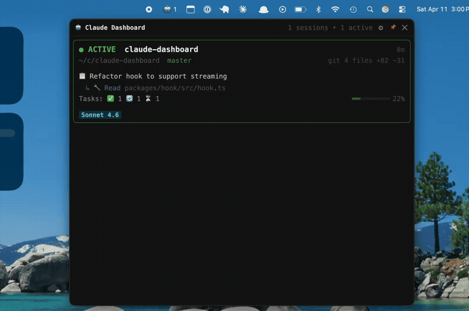
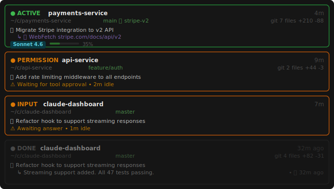

# Claude Session Dashboard

Real-time dashboard for monitoring multiple simultaneous Claude Code sessions. Runs as a macOS menu bar app — click the tray icon to see all sessions, or pop out a persistent floating panel.

## What it looks like

**Menu bar popover** (click the tray icon):

- Each session shows status badge, elapsed/ago time, project name, current task, last tool, git branch, worktree, git diff summary, commits ahead of upstream, model, and context usage
- Cards are color-coded: green border = active, orange = waiting for permission or input, dim = done
- Cards are ordered by priority: waiting → active → idle → done, then by most recent activity within each group
- While Claude is working but hasn't produced output yet, a "Clauding…" animated placeholder appears
- Click any card to bring that terminal window into focus
- Click the path on a card to copy the full path to the clipboard
- Hover a done card to reveal the `✕` dismiss button and clear it from the list
- Pop out a standalone always-on-top panel with the `⧉` button
- Click `🕐` to open the session history panel — a 30-day log of completed sessions grouped by day with cost totals

**Tray icon** shows the highest-priority state across all sessions:
| Icon | Meaning |
|------|---------|
| `🔐 2` | Sessions waiting for tool approval |
| `❓ 1` | Sessions waiting for your input |
| `🤖 3` | Active sessions (number = count) |
| `✅` | All sessions done |

## Demo



> Sessions cycling through active → waiting for permission → waiting for input → done, including a worktree session.

## How it works

Every time Claude Code uses a tool, a hook fires and updates `~/.config/claude-dashboard/sessions.json`. The menu bar watches that file and re-renders instantly on change.

```
Claude session (any project)
  → UserPromptSubmit / PreToolUse / PostToolUse / Stop / Notification hooks fire
  → ~/.config/claude-dashboard/hook.js runs
  → writes/updates ~/.config/claude-dashboard/sessions.json
  → Menu bar watches file → updates tray icon + popover
```

Each session tracks: status, current tool, last prompt and response, task list progress, running subagents, git branch, worktree, changed files, commits ahead of upstream, elapsed time, model, context %, and cost.

**Statuses:**

| Badge | Status | Meaning |
|-------|--------|---------|
|  | `active` | Claude is running |
|  | `waiting_permission` | Tool approval needed |
|  | `waiting_input` | Claude asked a question |
|  | `idle` | Between tool calls |
|  | `done` | Session finished |

**Example cards:**



**Worktree indicator:** When Claude is running inside a [git worktree](https://git-scm.com/docs/git-worktree) (including sessions spawned by Claude Code's Agent tool with `isolation: "worktree"`), a 🌿 icon appears after the branch name on the card — e.g. `main 🌿 stripe-v2`. The worktree name is the directory basename of the linked worktree.

**Loop detection:** If the same tool fires 5+ times in a row with no task state change, the session is flagged with a `LOOP` badge.

**Session history:** When a session expires past the stale timeout, it is archived to `~/.config/claude-dashboard/history.json` before being removed from the dashboard. The history panel (`🕐` button) shows the last 30 days grouped by day, with per-day session count and cost totals.

**Stale sessions** (no activity for 30 minutes by default) are pruned automatically — no cleanup needed.

## Requirements

- Node.js 18+
- macOS
- Claude Code installed

## Installation

```bash
git clone <this-repo> claude-dashboard
cd claude-dashboard
bash scripts/install.sh
```

That's it — no manual configuration needed. The install script handles everything, including updating `~/.claude/settings.json` so the dashboard automatically observes every Claude session on your machine.

The install script:
1. Builds all packages (`npm run build`)
2. Copies the compiled hook to `~/.config/claude-dashboard/hook.js`
3. Merges the five hooks into `~/.claude/settings.json` (creates the file if it doesn't exist; preserves existing hooks)

**What gets added to `~/.claude/settings.json`:**
```json
{
  "hooks": {
    "UserPromptSubmit": [{ "matcher": "", "hooks": [{ "type": "command", "command": "node ~/.config/claude-dashboard/hook.js user-prompt" }] }],
    "PreToolUse":       [{ "matcher": "", "hooks": [{ "type": "command", "command": "node ~/.config/claude-dashboard/hook.js pre-tool" }] }],
    "PostToolUse":      [{ "matcher": "", "hooks": [{ "type": "command", "command": "node ~/.config/claude-dashboard/hook.js post-tool" }] }],
    "Stop":             [{ "matcher": "", "hooks": [{ "type": "command", "command": "node ~/.config/claude-dashboard/hook.js stop" }] }],
    "Notification":     [{ "matcher": "", "hooks": [{ "type": "command", "command": "node ~/.config/claude-dashboard/hook.js notification" }] }]
  }
}
```

## Running

```bash
npm start -w packages/menubar
```

Right-click the tray icon to quit.

## Standalone panel

Click `⧉` in the popover header to open a persistent floating panel. It receives the same live updates as the popover and stays visible regardless of what you click. Use the pin button (red = always on top, gray = normal window) to toggle whether it floats above all other windows.

## Session history

Click `🕐` in the popover header to open the history panel. It shows all sessions that have expired from the dashboard over the past 30 days, grouped by day. Each day header shows the session count and total cost (when available). Each session row shows the directory name, duration, cost, model, and a truncated last prompt.

History is stored at `~/.config/claude-dashboard/history.json` and entries older than 30 days are pruned automatically.

## Settings

Click `⚙` in the popover to open the settings panel. Options:

| Setting | Description |
|---------|-------------|
| Stale session timeout | Hide sessions with no activity after this many minutes |
| Notifications | Show macOS notifications when sessions need attention or finish |
| Sound alerts | Play a system beep on permission/input transitions |
| Show git branch | Display the current git branch on each card |
| Show git diff summary | Show changed file count, line diff, and commits ahead of upstream (↑N) |
| Show subagent info | Show running subagent details |
| Show model & context | Show model name and context usage bar on active/idle cards |
| Show model & context on done cards | Show model name and context usage bar on completed cards |
| Compact paths | Abbreviate middle path segments (e.g. `~/c/claude-dashboard`) |
| Show session cost | Display the USD cost in the footer of done cards (API billing only) |

Changes take effect immediately — no restart needed.

## macOS permissions

If you see **"iTerm would like to access data from other apps"**, click **Allow** — this is needed to focus terminal windows when clicking a session card.

## Project structure

```
packages/
  shared/     Session types, sessions.json I/O, config reader
  hook/       Claude Code hook script (compiled to ~/.config/claude-dashboard/hook.js)
  menubar/    Electron tray app + popover
scripts/
  install.sh  Build + install
```

## Development

```bash
npm install
npm test          # run all tests
npm run build     # compile all packages
```

After modifying the hook:
```bash
npm run build -w packages/hook && cp packages/hook/dist/hook.js ~/.config/claude-dashboard/hook.js
```

After modifying the menubar:
```bash
npm run build -w packages/menubar
```

For live HMR during renderer development:

```bash
npm run dev
```

This starts the TypeScript watcher, Vite dev server, and Electron together. Renderer changes hot-reload instantly. Press `Ctrl+C` to stop everything. Changes to `main.ts` require restarting the command.

## Packaging as a .dmg

To build an unsigned distributable `.dmg`:

```bash
npm run dist -w packages/menubar
```

The output lands in `packages/menubar/release/Claude Dashboard-*.dmg`. Mount it, drag the app to Applications, and launch — the tray icon appears and the hook still fires correctly.

For a proper app icon, replace `packages/menubar/build/icon.png` with a 1024×1024 PNG before building.

**Code signing:** Signing config is stubbed in `packages/menubar/electron-builder.yml`. Uncomment the `identity`, `hardenedRuntime`, and entitlements lines and fill in your Apple Developer ID to enable notarization.

## Uninstalling

```bash
bash scripts/uninstall.sh
```

This removes the hook entries from `~/.claude/settings.json`, deletes `~/.config/claude-dashboard`, and removes the `claude-dashboard` launch script. Quit the menu bar app first if it is running.
