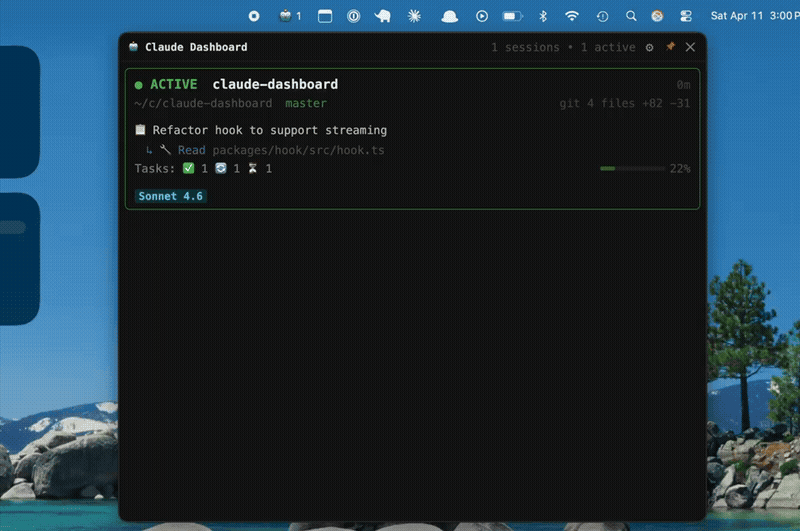
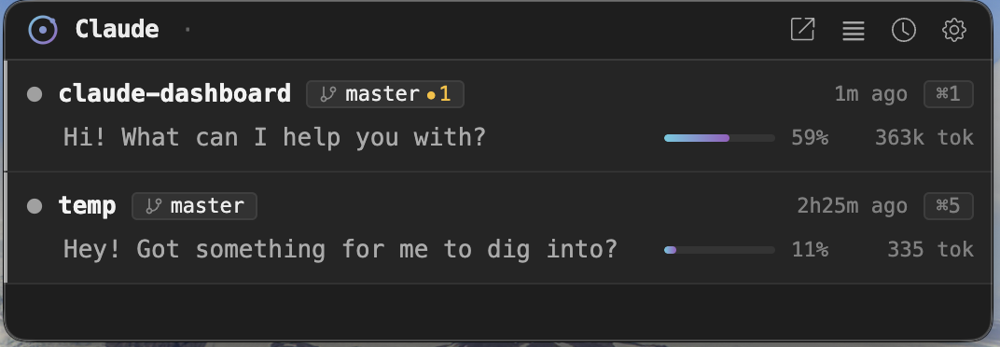

# Agent Dashboard

Real-time dashboard for monitoring multiple simultaneous Claude Code sessions. Runs as a macOS menu bar app — click the tray icon to see all sessions, or pop out a persistent floating panel.

## What it looks like

**Menu bar popover** (click the tray icon):

- Each session shows status badge, elapsed/ago time, project name, current task, last tool, git branch, worktree, git diff summary, commits ahead of upstream, model, and context usage
- Cards are color-coded: green border = active, orange = waiting for permission or input, dim = done
- Cards are ordered by priority: waiting → active → idle → done, then by most recent activity within each group
- While Claude is actively generating output, a partial response preview appears on the card in real time
- Click any card to bring that terminal window into focus
- Click the path on a card to copy the full path to the clipboard
- Hover any card — regardless of status — to reveal the `✕` dismiss button and clear it from the list. This is handy for a card that's stuck (e.g. permanently `active` after a crashed process). Dismissing removes the session record entirely; if the underlying session is still alive, the card reappears fresh on its next hook event (next prompt, tool call, etc.)
- Pop out a standalone always-on-top panel with the `⧉` button
- Toggle between **card** and **compact** view modes with the layout button in the header
- Click the **chevron** (▼/▶) at the left of the header to collapse the panel to header-only — just the brand, pills, and controls. Click again to expand. State persists across restarts. The `⧉` popout button remains visible when collapsed.
- The header shows live activity pills — **waiting**, **active**, and **inactive** (done + idle) counts at a glance. Pills are always visible regardless of which panel is open.
- Click `🕐` to open the session history panel — a 30-day log of completed sessions grouped by day with cost totals

**Tray icon** uses a circle-dot design that matches the dashboard's brand mark and adapts to your menu bar:

| State | Appearance | Meaning |
|-------|------------|---------|
| Idle / all done | White template icon | No active sessions (adapts to dark/light menu bar) |
| Active agents | Green pulsing icon | One or more sessions are running |
| Permission needed | Orange pulsing icon | A session is waiting for tool approval or input |

If **Show agent count in menu bar** is enabled (off by default), a numeric badge appears next to the icon showing the number of active sessions.

## Demo



> Sessions cycling through active → waiting for permission → waiting for input → done, including a worktree session.

## How it works

Every time Claude Code uses a tool, a hook fires and updates `~/.config/claude-dashboard/sessions.json`. The menu bar watches that file and re-renders instantly on change.

```
Claude session (any project)
  → UserPromptSubmit / PreToolUse / PostToolUse / Stop / Notification hooks fire
  → ~/.config/claude-dashboard/hook.js runs
  → writes/updates ~/.config/claude-dashboard/sessions.json
  → Menu bar watches file → updates tray icon + popover
```

Each session tracks: status, current tool, last prompt and response, task list progress, running subagents, git branch, worktree, changed files, commits ahead of upstream, elapsed time, model, context %, and cost.

**Cursor's native agent:** Cursor's built-in agent (separate from the `claude` CLI) also fires these hooks, but writes its transcripts in its own JSON schema — entries are keyed by `role` instead of `type`, and a turn's end is marked by a standalone `turn_ended` line rather than Claude Code's `stop_reason`. The dashboard recognizes both formats, so status, last prompt/response text, and turn count all populate correctly for Cursor sessions.

Cursor's transcripts don't carry model or usage data, but its hook payload does — the `user-prompt` and `stop` events include `model`/`model_id` directly, and `stop` includes per-turn `input_tokens`/`output_tokens`/`cache_read_tokens`/`cache_write_tokens`. The dashboard reads these straight off the payload for Cursor sessions (falling back only when the transcript itself has nothing), so model, context %, and token counts populate the same way they do for Claude Code sessions — just once per turn (at `stop`) rather than progressively. **Cost stays blank until you add pricing for Cursor's model** (e.g. `composer-2.5`) in Settings → Cost tab → Add custom, since there's no built-in price for non-Claude models.

**Cursor project name:** Claude Code's hook payload always includes `cwd`, so the dashboard shows the real project directory. Cursor's payload never includes `cwd` — the dashboard falls back to the first entry in `workspace_roots` (the folder(s) open in that Cursor window) when present. If a Cursor window has no folder open at all, there's no project directory to report; the card falls back to wherever Cursor happens to run hook commands from, which shows up as `.claude` (the directory containing `~/.claude/settings.json`, where it discovers the hook registration) rather than a real project name.

**Cursor CLI (`cursor-agent`):** The standalone terminal CLI is a separate binary from both the `claude` CLI and Cursor's IDE agent, with its own native hook system — it never reads `~/.claude/settings.json`. The dashboard registers into its config file, `~/.cursor/hooks.json`, automatically (same as the DMG app auto-wiring `~/.claude/settings.json` — no separate setup), wiring up `beforeSubmitPrompt`/`preToolUse`/`postToolUse`/`stop` — Cursor's CLI hook system has no Notification-equivalent event, so `waiting_permission`/`waiting_input` statuses won't appear for CLI sessions the way they can for Claude Code. CLI sessions are tagged the same `source: 'cursor'` as IDE sessions and go through the same transcript-schema detection (confirmed live: `cursor-agent`'s transcript format is identical to the IDE's — `role`-keyed entries, a trailing `turn_ended` marker).

Verified live against a real `cursor-agent` install (v2026.08.11): project name (`workspace_roots` fallback), session identity (`conversation_id`), and tool activity (`preToolUse`/`postToolUse`, including Cursor's own tool names — `Shell` for its shell tool, `path` instead of `file_path` for `Write`) all populate correctly. **One confirmed limitation, not a dashboard bug:** in `--print` mode (both `--mode ask` and the default agent mode), `cursor-agent` never fires `beforeSubmitPrompt` or `stop` — only the tool-use events. That means `--print`-driven sessions show live tool activity but never populate model, tokens, or prompt/response text, and never transition out of `active` status; they simply age out after `staleSessionMinutes` like any other stuck session. Interactive (non-`--print`) sessions haven't been tested — Cursor's CLI hook delivery has broader community reports of inconsistent firing depending on platform/version as of Aug 2026, which is outside the dashboard's control.

**Codex CLI (`codex`):** OpenAI's Codex CLI has its own native hook system, registered via `~/.codex/hooks.json` (auto-wired the same way as `~/.cursor/hooks.json`). Confirmed live against a real install (Codex CLI 0.147.0): its hook payload fields (`session_id`, `cwd`, `transcript_path`, `model`) already match Claude Code's naming, so no fallback parsing was needed the way Cursor required. Codex sessions are tagged `source: 'codex'`, get their own rollout-transcript parser (Codex's transcript format — newline-delimited `{timestamp, type, payload}` — is structurally different from both Claude Code's and Cursor's), and get **exact context-window tracking**: Codex reports its own `model_context_window` per turn, so context % doesn't rely on a static lookup table the way Claude/Cursor sessions do. Codex's `PermissionRequest` hook gives the dashboard a genuine `waiting_permission` signal — something Cursor CLI has no equivalent for. **Cost stays blank until you add pricing for your Codex model** in Settings → Cost tab → Add custom, same as any non-Claude model.

**Codex hook trust (one-time manual step):** Codex requires hooks to be manually trusted before they'll fire — this can't be automated by an installer. After running `scripts/install.sh` (or launching the packaged app), run `codex` once, then run `/hooks` inside the session and trust the `claude-dashboard` entries. Until this is done, Codex sessions produce no hook events at all and never appear on the dashboard — this is silent (no error, no card, nothing), so if a Codex session isn't showing up, check this first.

### Session card fields by agent

What each supported agent can populate on a session card. `✅` full support · `⚠️` partial or conditional (see notes) · `❌` not available.

| Card field                     | Claude Code | Cursor (IDE + CLI) | Codex CLI | Claude Desktop |
| ------------------------------ | :---------: | :----------------: | :-------: | :------------: |
| Agent identity (`source`)      |     ✅      |         ✅         |    ✅     |   ✅ (presence) |
| Project / directory name       |     ✅      |     ⚠️ ⁽¹⁾         |    ✅     |      ❌        |
| Git branch / worktree / diff   |     ✅      |         ✅         |    ✅     |      ❌        |
| Status (active / idle / done)  |     ✅      |         ✅         |    ✅     |   ⚠️ ⁽⁶⁾       |
| Waiting for permission         |     ✅      |     ❌ ⁽²⁾         | ✅ ⁽⁵⁾    |      ❌        |
| Waiting for input              |     ✅      |     ❌ ⁽²⁾         |    ❌     |      ❌        |
| Current / last tool + summary  |     ✅      |         ✅         |    ✅     |      ❌        |
| Last prompt                    |     ✅      |         ✅         |    ✅     |      ❌        |
| Last response text             |     ✅      |         ✅         |    ✅     |      ❌        |
| Live partial response (stream) |     ✅      |     ⚠️ ⁽³⁾         |    ✅     |      ❌        |
| Model                          |     ✅      |     ✅ ⁽³⁾         |    ✅     |      ❌        |
| Context %                      |     ✅      |     ✅ ⁽³⁾         | ✅ ⁽⁵⁾    |      ❌        |
| Token count                    |     ✅      |     ✅ ⁽³⁾         |    ✅     |      ❌        |
| Cost                           |     ✅      |     ⚠️ ⁽⁴⁾         | ⚠️ ⁽⁴⁾    |      ❌        |
| Turns                          |     ✅      |         ✅         |    ✅     |      ❌        |
| Tool count                     |     ✅      |         ✅         |    ✅     |      ❌        |
| Task-list progress             |  ✅ ⁽⁷⁾     |     ❌ ⁽⁷⁾         | ❌ ⁽⁷⁾    |      ❌        |
| Subagents                      |  ✅ ⁽⁷⁾     |     ❌ ⁽⁷⁾         | ❌ ⁽⁷⁾    |      ❌        |

**Notes**

1. Cursor's hook payload has no `cwd`; the dashboard falls back to the first `workspace_roots` entry (the folder open in that Cursor window), and shows `.claude` if no folder is open.
2. Cursor's hook system (confirmed for the `cursor-agent` CLI) has no Notification-equivalent event, so waiting-for-permission / waiting-for-input statuses are not surfaced for Cursor sessions.
3. Cursor carries model / usage on its `stop` payload, not progressively in the transcript, so model, context %, tokens, and the response text land **once per turn (at `stop`)** rather than streaming as the turn runs.
4. No built-in pricing exists for non-Claude models (e.g. Cursor's `composer-*`, Codex's `gpt-*`). Cost stays blank until you add a price in **Settings → Cost → Add custom**.
5. Codex reports its own `model_context_window` per turn, so its context % is **exact** rather than derived from a static lookup table; its `PermissionRequest` hook provides a genuine waiting-for-permission signal.
6. Claude Desktop appears as a presence-only card (it exposes no hooks or transcript) — it shows that the app is running but no per-session detail.
7. Task-list progress and subagents are driven by Claude Code's `TaskCreate` / `TaskUpdate` / `Agent` tools; other agents don't emit these tool events, so those fields stay empty.

**Statuses:**

| Badge                                                                   | Status               | Meaning                 |
| ----------------------------------------------------------------------- | -------------------- | ----------------------- |
|      | `active`             | Claude is running       |
|  | `waiting_permission` | Tool approval needed    |
|       | `waiting_input`      | Claude asked a question |
|        | `idle`               | Between tool calls      |
|        | `done`               | Session finished        |

**Example cards:**

*Compact view* — 2-line rows with branch, task preview, context bar, and elapsed time:



**Partial response preview:** While Claude is generating output, the card shows a live streaming preview of the response before the turn completes. In compact mode this appears as the task text; in card view it appears as a secondary line beneath the prompt.

**Worktree indicator:** When Claude is running inside a [git worktree](https://git-scm.com/docs/git-worktree) (including sessions spawned by Claude Code's Agent tool with `isolation: "worktree"`), a 🌿 icon appears after the branch name on the card — e.g. `main 🌿 stripe-v2`. The worktree name is the directory basename of the linked worktree.

**Loop detection:** If the same tool fires 5+ times in a row with no task state change, the card shows `↳ 🔧 ToolName ×N loop` in the tool row.

**Task list progress:** When Claude uses the `TodoWrite`/`TodoRead` tools to manage a task list, the card shows a progress row — e.g. `Tasks: ✅ 2  🔄 1  ⏳ 1` — reflecting completed, in-progress, and pending items. This updates live as Claude works through the list.

**Session history:** When a session expires past the stale timeout, it is archived to `~/.config/claude-dashboard/history.json` before being removed from the dashboard. The history panel (`🕐` button) shows the last 30 days grouped by day — click a day header to expand or collapse its sessions. Each day shows the session count and total cost; each session row shows the directory, duration, cost, model, and last prompt/response.

**Stale sessions** (no activity for 30 minutes by default) are pruned automatically — no cleanup needed.

**Claude Desktop presence card:** When Claude Desktop is running, a compact card appears at the bottom of the session list (below all Claude Code sessions). It shows the Claude icon, an "App is running" subtext, and a "● Running" pill. Clicking the card opens Claude Desktop. The card disappears automatically when Claude Desktop quits. It is excluded from the active/inactive session counts in the header. Can be turned off in Settings → General → "Show Claude Desktop card".

## Requirements

- macOS
- Claude Code installed
- Node.js 18+ _(source install only)_

## Download

**[Download the latest release →](https://github.com/meagle/claude-dashboard/releases/latest)**

1. Download `Agent Dashboard-x.x.x-arm64.dmg`
2. Open the DMG and drag **Agent Dashboard** to `/Applications`
3. Launch Agent Dashboard from `/Applications`

> **First launch:** macOS will block the unsigned app. If you see "damaged and can't be opened", run this in Terminal then launch normally:
>
> ```bash
> xattr -cr "/Applications/Agent Dashboard.app"
> ```
>
> On older macOS you may instead see an "unidentified developer" warning — right-click → **Open** → **Open** bypasses that. Either way, you only need to do this once.

The app automatically installs the hook and wires up `~/.claude/settings.json` on every launch — no separate setup step needed. Each new release also updates the hook automatically when you replace the app and relaunch.

## Installation from source

```bash
git clone https://github.com/meagle/claude-dashboard claude-dashboard
cd claude-dashboard
bash scripts/install.sh
```

That's it — no manual configuration needed. The install script handles everything, including updating `~/.claude/settings.json` so the dashboard automatically observes every Claude session on your machine.

The install script:

1. Builds all packages (`npm run build`)
2. Copies the compiled hook to `~/.config/claude-dashboard/hook.js`
3. Merges the five hooks into `~/.claude/settings.json` (creates the file if it doesn't exist; preserves existing hooks)
4. Merges four hooks into `~/.cursor/hooks.json` for `cursor-agent` CLI support (creates the file if it doesn't exist; preserves existing hooks)
5. Merges five hooks into `~/.codex/hooks.json` for Codex CLI support (creates the file if it doesn't exist; preserves existing hooks) — **requires a one-time manual trust step, see "Codex hook trust" above**

**Auto-detection:** the app only wires up an agent whose config directory already exists on your machine — it patches `~/.cursor/hooks.json` only if `~/.cursor` is present, and `~/.codex/hooks.json` only if `~/.codex` is present. It never creates a config directory for a tool you don't use. Because this runs on every launch, installing a new supported agent later gets picked up automatically the next time the app starts — no reinstall needed.

**Agent tagging:** each hook command is registered with an `--agent=<id>` flag (`claude-code`, `cursor`, or `codex`) so the hook knows which agent invoked it and dispatches straight to that agent's parser. If the flag is ever missing (e.g. an old registration), the hook falls back to detecting the agent from the transcript format.

**What gets added to `~/.claude/settings.json`:**

```json
{
  "hooks": {
    "UserPromptSubmit": [
      {
        "matcher": "",
        "hooks": [
          {
            "type": "command",
            "command": "node ~/.config/claude-dashboard/hook.js user-prompt --agent=claude-code"
          }
        ]
      }
    ],
    "PreToolUse": [
      {
        "matcher": "",
        "hooks": [
          {
            "type": "command",
            "command": "node ~/.config/claude-dashboard/hook.js pre-tool --agent=claude-code"
          }
        ]
      }
    ],
    "PostToolUse": [
      {
        "matcher": "",
        "hooks": [
          {
            "type": "command",
            "command": "node ~/.config/claude-dashboard/hook.js post-tool --agent=claude-code"
          }
        ]
      }
    ],
    "Stop": [
      {
        "matcher": "",
        "hooks": [
          {
            "type": "command",
            "command": "node ~/.config/claude-dashboard/hook.js stop --agent=claude-code"
          }
        ]
      }
    ],
    "Notification": [
      {
        "matcher": "",
        "hooks": [
          {
            "type": "command",
            "command": "node ~/.config/claude-dashboard/hook.js notification --agent=claude-code"
          }
        ]
      }
    ]
  }
}
```

**What gets added to `~/.cursor/hooks.json`:**

```json
{
  "version": 1,
  "hooks": {
    "beforeSubmitPrompt": [{ "command": "node ~/.config/claude-dashboard/hook.js user-prompt --agent=cursor" }],
    "preToolUse": [{ "command": "node ~/.config/claude-dashboard/hook.js pre-tool --agent=cursor" }],
    "postToolUse": [{ "command": "node ~/.config/claude-dashboard/hook.js post-tool --agent=cursor" }],
    "stop": [{ "command": "node ~/.config/claude-dashboard/hook.js stop --agent=cursor" }]
  }
}
```

**What gets added to `~/.codex/hooks.json`:**

```json
{
  "hooks": {
    "UserPromptSubmit":  [{ "matcher": "*", "hooks": [{ "type": "command", "command": "node ~/.config/claude-dashboard/hook.js user-prompt --agent=codex" }] }],
    "PreToolUse":        [{ "matcher": "*", "hooks": [{ "type": "command", "command": "node ~/.config/claude-dashboard/hook.js pre-tool --agent=codex" }] }],
    "PostToolUse":       [{ "matcher": "*", "hooks": [{ "type": "command", "command": "node ~/.config/claude-dashboard/hook.js post-tool --agent=codex" }] }],
    "Stop":              [{ "matcher": "*", "hooks": [{ "type": "command", "command": "node ~/.config/claude-dashboard/hook.js stop --agent=codex" }] }],
    "PermissionRequest": [{ "matcher": "*", "hooks": [{ "type": "command", "command": "node ~/.config/claude-dashboard/hook.js permission-request --agent=codex" }] }]
  }
}
```

## Running

```bash
npm start -w packages/menubar
```

Right-click the tray icon for **Pop Out Panel** and **Quit Agent Dashboard**.

## View modes

Click the layout button in the header to cycle through three view modes:

| Mode | Description |
|------|-------------|
| **Card** | Full cards with prompt, tool row, task progress, git info, and context bar |
| **Compact** | 2-line rows — identity + branch on line 1, task preview + context bar on line 2 |

Each mode shows: status dot, project name, branch pill, worktree indicator (🌿 name), task/prompt preview, loop chip, context bar, token count, ⌘-key shortcut, and elapsed time. The compact view uses a fixed-width trailing cluster so context bars and token columns line up vertically across rows.

The selected view mode is remembered across sessions and synced between the popover and the standalone panel. Window width is saved per mode so each view can have its own preferred width.

## Standalone panel

Click `⧉` in the popover header to open a persistent floating panel. It receives the same live updates as the popover and stays visible regardless of what you click. Use the pin button to toggle whether it floats above all other windows — a **filled pin** means always-on-top is enabled, an **outline pin** means it is a normal window. The panel remembers its position and size between launches.

By default the panel opens automatically when the app launches, so the dashboard stays reachable even if the tray icon gets hidden in macOS's menu-bar overflow. Turn this off with the **Open panel on launch** setting, or reopen it any time via the tray icon's right-click menu (**Pop Out Panel**).

## Session history

Click `🕐` in the popover header to open the history panel. It shows all sessions that have expired from the dashboard over the past 30 days, grouped by day. Click any day header to expand or collapse that day's sessions. Each day header shows the session count and total cost; each session row shows the directory name, last prompt, last response, duration, cost, and model.

History is stored at `~/.config/claude-dashboard/history.json` and entries older than 30 days are pruned automatically.

## Settings

Click `⚙` in the popover to open the settings panel. The panel has three tabs: **General**, **Cost**, and **Models**.

### General tab

| Setting                            | Description                                                            |
| ---------------------------------- | ---------------------------------------------------------------------- |
| Stale session timeout              | Hide sessions with no activity after this many minutes                 |
| Notifications                      | Show macOS notifications when sessions need attention or finish        |
| Sound alerts                       | Play a system beep on permission/input transitions                     |
| Show git branch                    | Display the current git branch on each card                            |
| Show git diff summary              | Show changed file count, line diff, and commits ahead of upstream (↑N) |
| Show subagent info                 | Show running subagent details                                          |
| Show model & context               | Show model name and context usage bar on active/idle cards             |
| Show model & context on done cards | Show model name and context usage bar on completed cards               |
| Compact paths                      | Abbreviate middle path segments (e.g. `~/c/claude-dashboard`)          |
| Footer style                       | **Default** shows horizontal stat chips; **Grid** shows a 6-cell labeled grid (Model, Context, Cost, Tokens, Tools, Turns) centered at the bottom of each card |
| Show agent count in menu bar       | Show a numeric count of active sessions next to the tray icon (off by default) |
| Show Claude Desktop card           | Show a presence card at the bottom of the list when Claude Desktop is running (on by default) |
| Pinned panel opacity               | Transparency level of the floating panel when not hovered                      |
| Collapsed panel always opaque      | Keep the floating panel at full opacity when it is in collapsed (header-only) mode |
| Open panel on launch               | Automatically open the standalone floating panel when the app starts (on by default) |

### Cost tab

- **Model pricing table** — shows current prices per million tokens for each Claude model family, auto-fetched from [LiteLLM's pricing data](https://github.com/BerriAI/litellm) on startup (cached for 24 hours). Click any price cell to edit it inline; edited values are saved as custom overrides.
- **Custom model prefixes** — add pricing for proxy models or future Claude versions using the **+ Add custom model** form. Custom entries take precedence over fetched prices.
- **↻ Refresh** — force re-fetch the latest pricing from LiteLLM immediately.
- **Show session cost** — display the estimated USD cost in the footer of done cards. API billing only — not meaningful on Pro or Max subscriptions.

### Models tab

- **Context window table** — shows the maximum context window (tokens) for each Claude model prefix, auto-fetched from LiteLLM on startup. Click any value to edit it inline; edited values are saved as custom overrides marked with an orange dot.
- **Why this matters** — the context % shown on session cards is calculated against this window size. If your plan (e.g. Claude Pro) has a smaller context limit than the API default, override the model prefix here to get accurate readings.
- **Custom model prefixes** — add context window sizes for proxy models or future Claude versions using the **+ Add custom model** form.
- **Reset overrides** — clears all custom context window overrides and restores fetched values.

**Model colors:** Each model row has a color swatch and A/B/C style selector. Click the swatch (or edit the hex field) to set a color; the style toggle controls how the badge renders:
- **A** — tinted background with colored text
- **B** — solid color background with white text
- **C** — ghost style with translucent background and a colored border

Colors apply consistently everywhere a model name appears: session card footer badges, history panel session pills, and history chart segments. Default color for all models is `#D97757` (Claude orange).

Changes take effect immediately — no restart needed.

## How cost is calculated

Session cost (`costUsd`) is computed by the hook script each time it reads the transcript, then stored in `sessions.json` alongside the session data.

### Per-turn accumulation

The hook walks the transcript backward and calls `calcTurnCost()` for every assistant turn that has usage data. Each turn's cost is:

```
cost = (input_tokens × input_$/M
      + cache_creation_input_tokens × cache_write_$/M
      + cache_read_input_tokens × cache_read_$/M
      + output_tokens × output_$/M) / 1_000_000
```

All turns are summed into a single `costUsd` value for the session. `totalTokens` (input + output across all turns) is accumulated the same way.

### Pricing lookup order

When computing a turn's cost the hook resolves the model price using this priority:

1. **Custom overrides** — prices you edited inline in the Cost tab (stored in `config.json → modelPricing.custom`). Matched by model ID prefix.
2. **Fetched LiteLLM prices** — auto-fetched on startup from [LiteLLM's community pricing table](https://github.com/BerriAI/litellm/blob/main/model_prices_and_context_window.json) and cached for 24 hours (stored in `config.json → modelPricing.fetched`). Also matched by prefix.
3. **Hardcoded fallback** — a small table of Claude family prices baked into the hook binary, used when neither of the above matches.

Custom overrides always win. To revert a model to its fetched price, use **Reset overrides** in the Cost tab.

### When prices are applied

The hook reads `~/.config/claude-dashboard/config.json` fresh on every invocation, so any pricing change you save in the Cost tab is picked up immediately by the next Claude Code turn. However, `costUsd` values already written to `sessions.json` or `history.json` are **not retroactively recalculated** — only new turns accumulate cost under the updated prices.

### What the "Show session cost" toggle does

The toggle in the Cost tab controls display only — it does not affect whether `costUsd` is computed. The hook always calculates and stores cost. Turning the toggle off hides the cost chip on session cards and the cost/token pills on history rows. The **History Charts** view always displays cost data regardless of this setting.

### Subscriptions vs. API billing

Cost figures reflect API token prices. They are not meaningful on Claude Pro or Max subscriptions, which are billed as a flat monthly fee with no per-token charges.

## macOS permissions

If you see **"iTerm would like to access data from other apps"**, click **Allow** — this is needed to focus terminal windows when clicking a session card.

## Project structure

```
packages/
  shared/     Session types, sessions.json I/O, config reader
  hook/       Claude Code hook script (compiled to ~/.config/claude-dashboard/hook.js)
  menubar/    Electron tray app + popover
scripts/
  install.sh    Build + install
  mov-to-gif.sh Convert a QuickTime screen recording to an animated GIF (used for docs/demo.gif)
```

## Development

```bash
npm install
npm test          # run all tests
npm run build     # compile all packages
```

After modifying the hook:

```bash
npm run build -w packages/hook && cp packages/hook/dist/hook.js ~/.config/claude-dashboard/hook.js
```

After modifying the menubar:

```bash
npm run build -w packages/menubar
```

For live HMR during renderer development:

```bash
npm run dev
```

This starts the TypeScript watcher, Vite dev server, and Electron together. Renderer changes hot-reload instantly. Press `Ctrl+C` to stop everything. Changes to `main.ts` require restarting the command.

## Adding a new agent

Every supported agent lives behind a single **`AgentDescriptor`** in `packages/shared/src/agents/`. Adding one (e.g. Gemini CLI, Aider) is essentially one new file — **`main.ts` and the hook need no changes.**

**1. Write the descriptor** — `packages/shared/src/agents/<id>.ts`, exporting `<id>Descriptor: AgentDescriptor`:

| Field | What it does |
| --- | --- |
| `id` | stable slug (e.g. `'gemini'`) — becomes `Session.source` |
| `displayName` / `color` / `iconKey` | UI identity: chip label, hex color, icon key |
| `processPattern` | regex matching the agent's process args, for the pid-liveness guard (e.g. `/gemini/i`) |
| `matchesTranscript(line)` | recognize this agent's transcript from one parsed line (probe fallback) |
| `parse(lines, endTurnOnly, cfg)` | the agent's **own** transcript walking → `TranscriptStats`; normalize usage, then call the shared `calcTurnCost`. Start from the closest existing family — `claudeCode.ts`/`cursor.ts` (one entry per message) or `codex.ts` (rollout format). |
| `toolSummary(tool, input)` | map the agent's tool names to a one-line summary |
| `payload` / `sessionIdFromPayload` / `cwdFromPayload` | which hook-payload fields carry the session id and cwd |
| `isInstalled(home)` | detect the agent's presence (e.g. `existsSync(`${home}/.gemini`)`) — powers auto-detect |
| `configPath(home)` / `defaultConfig()` / `installHooks(config, hookCmd)` | the agent's native hook-config file, its empty shape, and how to write dashboard entries (copy the flat-vs-nested pattern from `cursor.ts` / `codex.ts`) |

**2. Register it** — add the descriptor to the `HOOK_AGENTS` array in `packages/shared/src/agents/index.ts`. That one array drives install, uninstall, process detection, transcript probing, and the `SOURCES` manifest automatically.

**3. Add the id to the union** — extend `Session['source']` in `packages/shared/src/types.ts` to include `'<id>'`.

**4. Pin its parsing** — drop a redacted real transcript into `packages/hook/src/__tests__/fixtures/` and snapshot `<id>Descriptor.parse(...)` in `goldenParse.test.ts`, matching the pattern used for the existing agents.

Then rebuild and relaunch (or ship a new `.dmg`). Install is automatic: the app wires the agent up on launch **only if its config directory exists**, and re-checks every launch. A newly-added agent works end to end immediately (parsing, `source`, install, cards); a distinct **identity chip** in the UI depends on the pending awareness-UX work (see `docs/plans/2026-08-16-awareness-ux.md`).

## Packaging as a .dmg

To build an unsigned distributable `.dmg`:

```bash
npm run dist -w packages/menubar
```

The output lands in `packages/menubar/release/Agent Dashboard-*.dmg`. Mount it, drag the app to Applications, and launch — the tray icon appears and the hook still fires correctly.

For a proper app icon, replace `packages/menubar/build/icon.png` with a 1024×1024 PNG before building.

**Code signing:** Signing config is stubbed in `packages/menubar/electron-builder.yml`. Uncomment the `identity`, `hardenedRuntime`, and entitlements lines and fill in your Apple Developer ID to enable notarization.

## Uninstalling

```bash
bash scripts/uninstall.sh
```

This removes the hook entries from `~/.claude/settings.json`, `~/.cursor/hooks.json`, and `~/.codex/hooks.json`, deletes `~/.config/claude-dashboard`, and removes the `claude-dashboard` launch script. Quit the menu bar app first if it is running.
